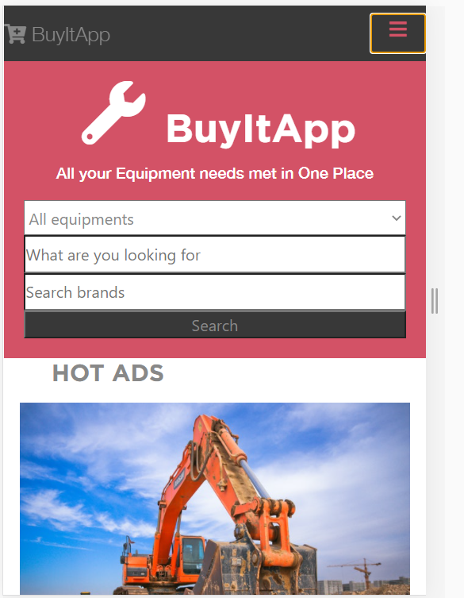
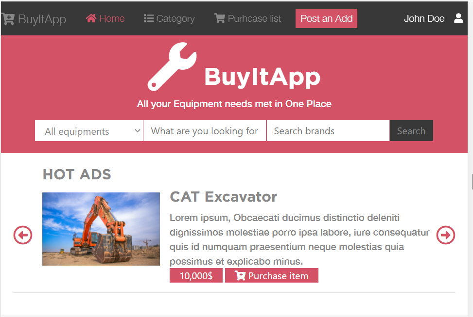
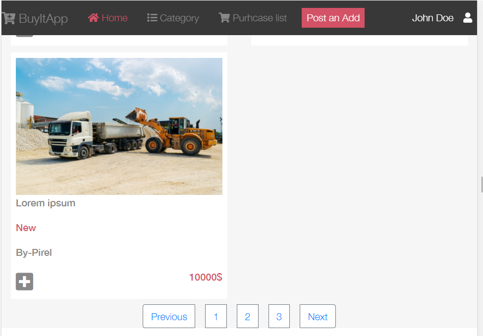
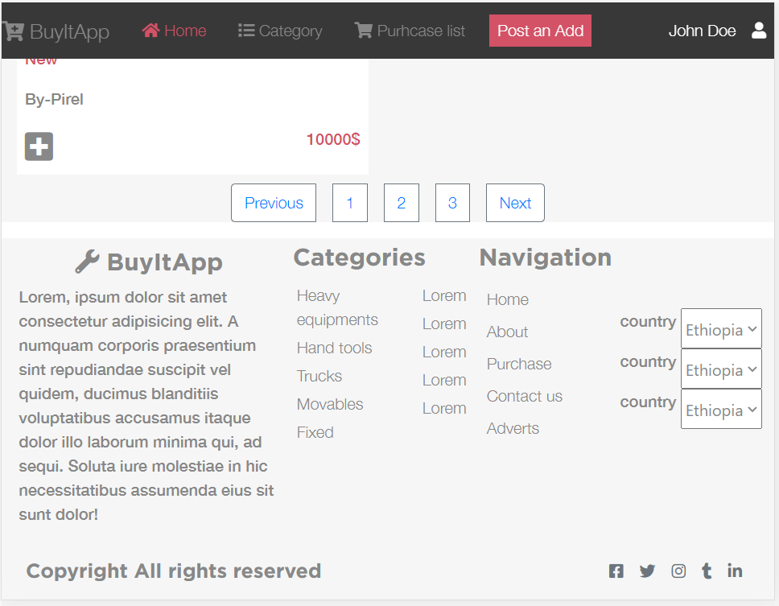
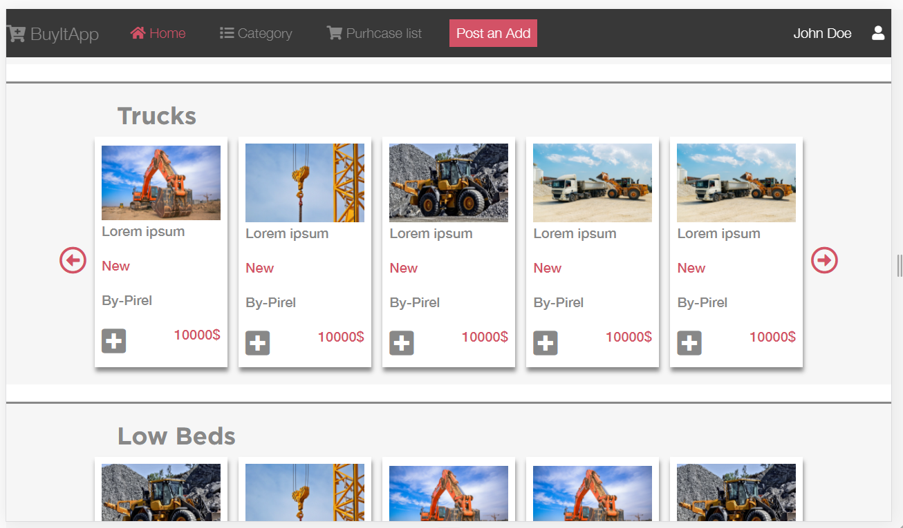
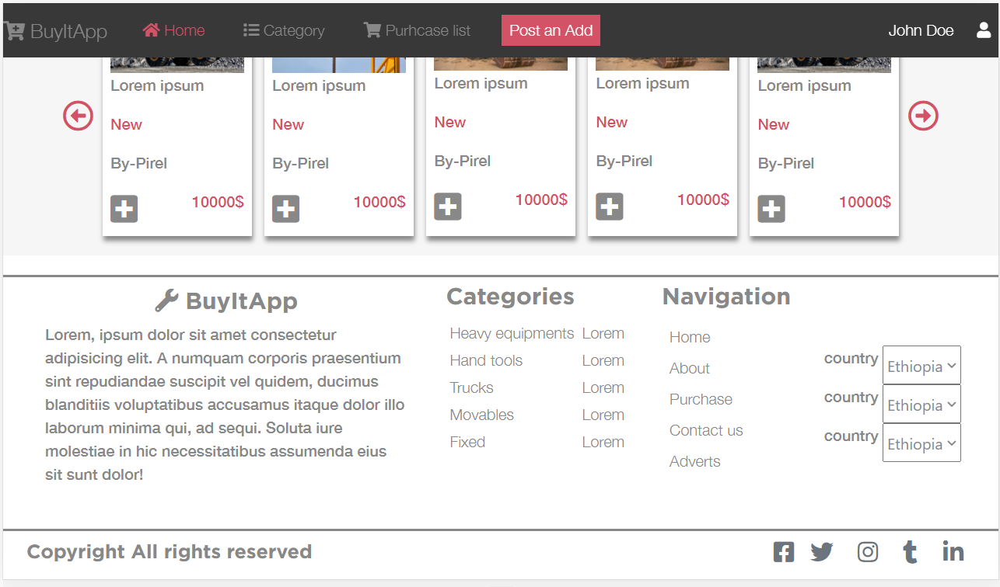

## Capstone

</h1>This is an e-commerce website developed for a construction equipments vendor for as  the capstone project for the microverse html/css track</h1>

## Built With

Html

CSS

Bootstrap

SASS

font-awesome

Visual code

## Live Demo

[Live Demo Link](https://eloquent-pare-715543.netlify.app/)

## Prerequisites

Text editor,Github profile and Git.

## Author

👤 Sinework

- Github: [@sinework](https://github.com/sinework)

- LinkedIn: [LinkedIn](https://www.linkedin.com/in/sinework-amare-731a6a125/)

## 🤝 Contributing

Contributions, issues and feature requests are welcome!

Feel free to check the issues page.

Show your support

Give a ⭐️ if you like this project!

## 🤝 Acknowledgment

Design idea by Mohammed Awad on Behance

## 📝 Mit License

This project is a collaboration project of microverse students. All rights are reserved for

Sinework.
